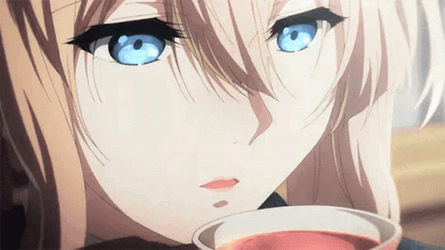

  

<h1 align="center">Hello 👋🏼</h1>

 
<h3 align="left">About Me</h3>

An ordinary person who likes to experiment with things he likes.

 
<h3 align="left">Profiles Views</h3>

  

 
<h3 align="left">Daily Contribution on Github</h3>

<picture>
  <source media="(prefers-color-scheme: dark)" srcset="https://raw.githubusercontent.com/src-06/src-06/pacman/pacman-contribution-graph-dark.svg">
  <source media="(prefers-color-scheme: light)" srcset="https://raw.githubusercontent.com/src-06/src-06/pacman/pacman-contribution-graph.svg">
  
</picture>
